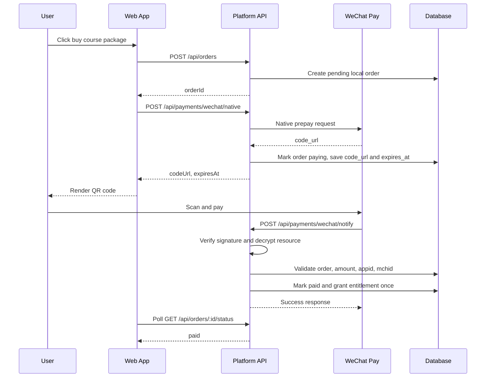

# WeChat Pay Native

This document records the Phase 16 payment direction correction. The target payment method is WeChat Pay Native scan-code payment. EasyPay is deprecated as a target path and must not remain the default payment scheme.

Current status: mock Native payment skeleton is implemented. The real WeChat Pay live API, request signing, callback signature verification, callback decryption, and callback-based entitlement grant are not wired yet.

## Payment Flow

## Environment Variables

| Variable | Required in live | Notes |
| --- | --- | --- |
| `WECHAT_PAY_MODE` | yes | `mock` or `live`. Production must not use `mock`. |
| `WECHAT_PAY_APPID` | yes | WeChat app ID used by the merchant. |
| `WECHAT_PAY_MCH_ID` | yes | Merchant ID. |
| `WECHAT_PAY_API_V3_KEY` | yes | API v3 key used for callback resource decryption. Never commit it. |
| `WECHAT_PAY_MERCHANT_SERIAL_NO` | yes | Merchant certificate serial number for request signing. |
| `WECHAT_PAY_MERCHANT_PRIVATE_KEY` | one of private key or path | PEM text from environment. Prefer deployment secrets. |
| `WECHAT_PAY_MERCHANT_PRIVATE_KEY_PATH` | one of private key or path | Local private key file path. Never commit PEM files. |
| `WECHAT_PAY_PLATFORM_CERTS_DIR` | yes | Directory for WeChat platform certificates used for signature verification. |
| `WECHAT_PAY_NOTIFY_URL` | yes | Public HTTPS notify URL. |
| `WECHAT_PAY_NATIVE_EXPIRE_MINUTES` | yes | QR code/order expiry window, default 15 minutes. |

## Mock Mode

- Allowed only in `development` and `test`.
- Used to generate a fake `codeUrl` and exercise order status handling without real merchant credentials.
- Production must fail fast or return a clear configuration error if `NODE_ENV=production` and `WECHAT_PAY_MODE=mock`.
- Mock payment must not grant entitlements through frontend state. Entitlements are only granted by server-side payment confirmation logic.

## Live Mode

Live mode will call WeChat Pay API v3 Native order creation:

- Endpoint: `POST /v3/pay/transactions/native`
- `description`: course package title.
- `out_trade_no`: local unique order number.
- `notify_url`: `WECHAT_PAY_NOTIFY_URL`.
- `amount.total`: integer cents from the server-side package price.
- Request signature: merchant private key and merchant serial number.

If any required live config is missing, the payment API must return a configuration error. It must never silently fall back to mock.

## Notify Verification And Decryption

The notify endpoint does not require user login, but it must perform all payment security checks:

1. Read WeChat headers: `Wechatpay-Timestamp`, `Wechatpay-Nonce`, `Wechatpay-Signature`, `Wechatpay-Serial`.
2. Verify the callback signature with the matching WeChat platform certificate.
3. Decrypt `resource` with AES-256-GCM using `WECHAT_PAY_API_V3_KEY`.
4. Validate `appid` and `mchid`.
5. Find the local order by `out_trade_no`.
6. Validate `amount.total` equals the local order `amount_total`.
7. If `trade_state` is `SUCCESS`, mark the order paid and grant entitlement once.
8. If the order is already paid, return success without granting another entitlement.

Failures in signature verification, decryption, order lookup, appid/mchid validation, or amount validation must not grant entitlement.

## Local Order State Machine

Local order status:

- `pending`: local order created.
- `paying`: WeChat Native code URL generated.
- `paid`: callback confirmed successful payment.
- `closed`: user/admin closed the order.
- `expired`: payment window expired.
- `failed`: unrecoverable payment failure.
- `refunded`: reserved for later.

WeChat trade state should be stored separately:

- `SUCCESS`
- `NOTPAY`
- `CLOSED`
- `REVOKED`
- `USERPAYING`
- `PAYERROR`

Do not mix local order status with WeChat trade state.

## Entitlement Rules

- The frontend never grants entitlements.
- Entitlements are granted only after server-side payment confirmation.
- Resource type for course packages: `course_package`.
- Source: `order`.
- Entitlement creation must be idempotent so duplicate callbacks cannot create duplicate access records.
- Paid material downloads must check entitlement on the server before returning files or temporary URLs.

## Material Delivery Direction

Core course materials are prepared manually. The current target is:

- import prepared materials through a manifest or admin workflow;
- bind materials to school, college, major, grade, course, and course package;
- keep real PDFs outside the repository under deployment storage or ignored `uploads/materials`;
- expose paid files only through the server-side download API.

AI-generated materials are not the current main delivery flow.

## Common Failure Cases

- Production is configured with `WECHAT_PAY_MODE=mock`.
- Live mode lacks app ID, merchant ID, API v3 key, serial number, private key, platform certificate, or notify URL.
- Callback signature verification fails.
- Callback resource decryption fails.
- `out_trade_no` does not match a local order.
- Callback amount differs from local `amount_total`.
- Callback merchant/app ID differs from configured values.
- Duplicate successful callback arrives after the order is already paid.
- User attempts to pay or query another user's order.

## Integration Checklist

- [x] Remove EasyPay as the default payment path.
- [x] Add `payment_provider=wechat_native` to order creation.
- [x] Store amount in integer cents.
- [x] Add WeChat Native mock order creation service.
- [x] Enforce production config validation.
- [ ] Add callback signature verification.
- [ ] Add callback resource decryption.
- [ ] Validate appid, mchid, order number, and amount.
- [ ] Grant course package entitlement idempotently.
- [ ] Add QR code payment UI.
- [x] Add order status polling that never grants entitlement.
- [ ] Add material manifest import with path traversal protection.
- [x] Replace legacy EasyPay tests with WeChat Native tests.
