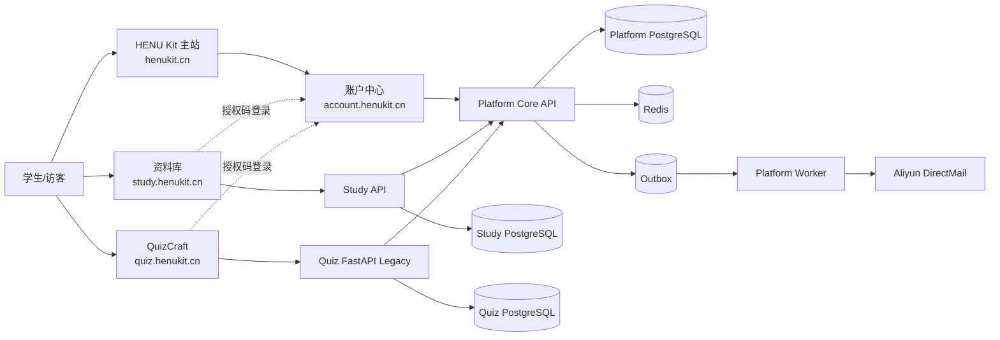

# HENU Kit Monorepo 架构

> 状态：目标架构 v1.0  
> 原则：先形成一个仓库，再逐步形成清晰模块；不把“进入 monorepo”误解为“一次性重写”。

## 1. 决策

当前 `final-review-platform` 将作为 HENU Kit 最终开发仓库，并在迁移完成后改名为 `HENU-Kit`。

原 `jry21223/HENU-Kit` 的产品规范、路线图和设计系统迁入本仓库；原 `jry21223/quizcraft-cn` 以 subtree 方式导入本仓库。迁移完成后，旧仓库保留只读说明和迁移链接，不再并行发展新的事实来源。

## 2. 为什么使用 Monorepo

本次 monorepo 的目标不是让所有代码变成一个进程，而是解决：

- 产品规范分散。
- 账户、通知和 API 契约重复定义。
- 资料库和刷题边界容易再次重叠。
- 跨仓库变更难以一次评审和回归。
- CI、部署、设计 token 和安全基线不一致。

Monorepo 仍允许：

- Next.js、Vue、React/Vite 并存。
- Go 与 Python 并存。
- 子产品独立构建、独立镜像和独立部署。
- PostgreSQL 按服务独立数据库或 schema。
- 按路径触发 CI/CD。

## 3. 迁移期间的真实结构

```text
final-review-platform/                # 迁移完成后改名 HENU-Kit
├── apps/
│   ├── web/                          # 当前 Next.js，迁移期作为资料库 Web
│   ├── admin/                        # 当前 Vue Admin
│   └── portal/                       # 新 HENU Kit 主站
├── services/
│   ├── api/                          # 当前 Go API；迁移期兼容层
│   └── worker/                       # 当前 Go Worker
├── products/
│   └── quizcraft/                    # 从 quizcraft-cn 导入的完整产品
├── packages/
│   ├── design-tokens/                # 跨框架 CSS/JSON token
│   └── api-contracts/                # OpenAPI 与事件 schema
├── docs/
│   ├── product/
│   ├── architecture/
│   ├── migrations/
│   └── adr/
├── infra/
├── scripts/
└── legacy/
```

`products/quizcraft` 是迁移缓冲区。它先保持原仓库目录和运行方式，避免导入当天同时修改 FastAPI、React、部署脚本和数据库。

## 4. 目标结构

```text
HENU-Kit/
├── apps/
│   ├── portal/                       # henukit.cn
│   ├── study-web/                    # study.henukit.cn，Next.js
│   ├── study-admin/                  # 资料管理后台，Vue
│   └── quiz-web/                     # quiz.henukit.cn，React/Vite
├── services/
│   ├── platform-core/                # Go 模块化单体 API
│   ├── platform-worker/              # 邮件、通知、统计、Outbox
│   ├── study-api/                    # 资料库业务 API
│   ├── study-worker/                 # 资料处理任务（如需要）
│   └── quiz-api-legacy/              # FastAPI，逐接口迁移期间保留
├── packages/
│   ├── design-tokens/
│   ├── api-contracts/
│   ├── event-schemas/
│   └── test-fixtures/
├── data/
│   └── course-quiz-mapping/           # 课程 ID 与题库 ID 映射
├── infra/
│   ├── compose/
│   ├── nginx/
│   ├── migrations/
│   └── scripts/
├── docs/
├── scripts/
└── legacy/
```

目标结构不要求在一个 PR 中完成。每次路径移动都必须先让 CI、Docker、部署脚本和运行手册支持新旧路径，再删除旧路径。

## 5. 运行时架构



GitHub Markdown 可以渲染 Mermaid。导出 DOCX/PDF 时必须先将 Mermaid 渲染为 SVG/PNG，不能把源码当普通代码块排版。

## 6. 模块化单体边界

`services/platform-core` 采用 Go 模块化单体，首批模块：

```text
internal/
├── identity/
├── verification/
├── authorization/
├── session/
├── clientregistry/
├── accountlink/
├── event/
├── outbox/
├── notification/
├── email/
├── serviceregistry/
├── metrics/
└── audit/
```

模块之间通过显式接口调用，不允许直接操作其他模块的 repository。第一阶段不拆微服务。

## 7. 数据 Owner

| 数据 | 唯一 Owner | 允许访问方式 |
|---|---|---|
| 用户、邮箱身份、会话、账号绑定 | Platform Core | 平台 API |
| 邮件投递、通知偏好、站内通知 | Platform Core | 平台 API/事件 |
| 课程、资料、文件、下载审计 | Study API | Study API |
| 题库、题目、作答、错题、排行 | Quiz API | Quiz API |
| 餐厅、榜单、投稿 | Campus/Food 模块 | 对应业务 API |
| 工具目录和产品状态 | Portal | Portal 内容源/API |

禁止跨服务直接 JOIN 数据库。需要聚合时使用 API、事件投影或离线指标表。

## 8. 统一账户

由于 `henukit.cn`、`study.superhuazai.me` 和 `superhuazai.me` 不是可共享 Cookie 的同一主域，统一登录使用简化 Authorization Code Flow：

1. 业务站后端创建登录意图并生成 `state`。
2. 浏览器跳转 `account.henukit.cn/authorize`。
3. 用户输入学生邮箱并完成验证码验证。
4. 平台生成短期、单次授权码。
5. 浏览器跳回登记过的 callback。
6. 业务站后端使用 client 凭据和授权码交换统一用户身份。
7. 业务站建立自己的 HttpOnly、Secure 会话。
8. `return_to` 仅允许登记过的站内路径。

不允许 URL 长期 Token、localStorage 长期 JWT、任意 callback、任意 `return_to` 或业务站读取平台数据库。

## 9. API 契约

新接口统一：

- 前缀：`/api/v1`
- JSON：`snake_case`
- 时间：UTC ISO 8601
- 公开 ID：UUIDv7、ULID 或等价不可猜测 ID
- 响应：始终包含 `request_id`
- 写接口：按场景支持 `Idempotency-Key`
- 内部 API 与浏览器 API 分组
- OpenAPI 3.1 为唯一契约来源

成功：

```json
{
  "data": {},
  "request_id": "req_xxx"
}
```

失败：

```json
{
  "error": {
    "code": "VERIFICATION_CODE_EXPIRED",
    "message": "验证码已过期，请重新获取",
    "details": null
  },
  "request_id": "req_xxx"
}
```

现有 final-review API 的 `{code,message,data}` 和 QuizCraft 的裸 JSON 不在同一发布中强制修改。兼容层负责转换，新前端只依赖新契约。

## 10. 事件与邮件

业务模块不得调用通用 `send-email`。标准流程：

```text
业务事件
→ 服务身份与幂等校验
→ events + outbox_events 同事务写入
→ Worker 消费
→ 创建站内通知
→ 检查通知偏好
→ 邮件队列
→ 模板渲染
→ DirectMail
→ 记录投递结果
→ 重试 / 死信
```

首批事件：

- `submission.received`
- `submission.approved`
- `submission.rejected`
- `correction.resolved`
- `points.credited`
- `school_notice.created`
- `school_notice.updated`

验证码使用独立 `critical` 队列，不能被摘要邮件阻塞。

## 11. QuizCraft 渐进迁移

迁移顺序：

1. 导入原仓库，保持原部署可运行。
2. 建立统一用户适配，不改题库数据。
3. 建立 Go 兼容入口和功能开关。
4. 迁移题库只读接口。
5. 迁移反馈与非核心写接口。
6. 对作答、统计和排行榜做双算一致性验证。
7. 迁移作答写接口。
8. 迁移题库工坊。
9. FastAPI 零生产流量稳定观察后归档。

任何阶段均保留回到 FastAPI 的路由开关。

## 12. 资料库收敛

`apps/web` 和 `services/api` 迁移时先隐藏非资料库入口，再迁移数据 Owner，最后删除代码。顺序不能反过来。

- 刷题入口改为 QuizCraft 跳转。
- Blog、论坛、动态、泛社区从学生主导航移除。
- 支付、会员和积分不在平台重构期扩展。
- Wiki 仅保留与资料整理、勘误和说明直接相关的部分。
- 资料上传、审核、下载权限和审计测试必须保留。

## 13. 部署单元

即使位于同一仓库，各部署单元仍独立：

- `portal-web`
- `study-web`
- `study-admin`
- `study-api`
- `study-worker`
- `platform-core-api`
- `platform-core-worker`
- `quiz-web`
- `quiz-api-legacy`

镜像必须使用 commit SHA。路径变更不能要求所有服务同时发布。

## 14. CI 路径过滤

CI 根据改动路径运行：

| 路径 | 必跑任务 |
|---|---|
| `apps/portal/**` | lint、typecheck、build、移动端 smoke |
| `apps/web/**` | Next.js build、资料库 E2E |
| `apps/admin/**` | Vue typecheck、build、审核 smoke |
| `services/api/**` | Go test、race、integration、migration |
| `services/worker/**` | Go test、Redis/Postgres integration |
| `products/quizcraft/**` | Python smoke、前端 lint/type/build、syntax tests、Playwright |
| `packages/api-contracts/**` | OpenAPI lint、生成一致性、契约测试 |
| `packages/design-tokens/**` | token schema、视觉快照、消费方 build |

共享契约或 token 变更会触发所有消费方测试。

## 15. 仓库改名条件

完成以下条件后，将 GitHub 仓库从 `final-review-platform` 改名为 `HENU-Kit`：

- 根 README 和文档已转为 HENU Kit。
- QuizCraft 已导入。
- 主站代码已进入本仓库。
- 旧学习平台仍能从新仓库构建和部署。
- CI/CD 不依赖硬编码旧仓库名。
- 部署密钥、Webhook、GitHub App 和外部文档已盘点。
- 已发布重命名通知和旧链接兼容说明。

改名不是第一步，避免在路径、CI 和产品边界同时变化时增加排障变量。