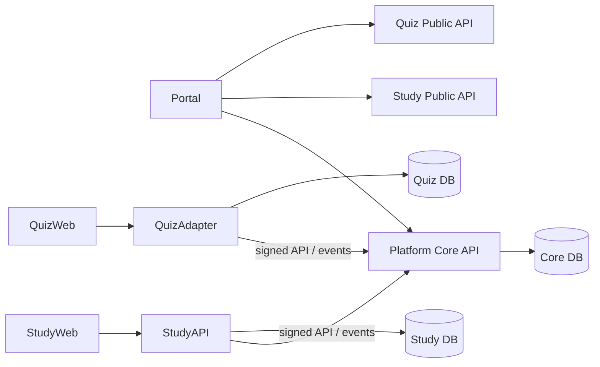

# 架构与模块边界规范

> 来源：`HENUKitDev-Monorepo-重构与渐进迁移开发计划-V2.1`。本文件是面向 1–2 名开发、1–2 名测试的执行抽取版。  
> 原计划保留为审计与证据文档；本文件用于日常开发、评审、测试和发布。  
> 固定原则：`expand -> migrate -> contract`；业务变化、数据库迁移、目录移动、域名切换和仓库改名不得合并为一次大改动。


## 1. 仓库与运行时原则

- 一个 Monorepo，不等于一个运行时单体。
- Portal、Platform Core、Study、Quiz 仍是独立 Deploy Unit，允许不同技术栈和发布节奏。
- 第一阶段至少维持 `henukit_core`、`final_review_v2`、`quizcraft` 三个独立数据库。
- 业务服务不得使用其他服务的数据库账号；跨服务只能通过 API 或事件。
- 公开 `HENU-Kit` 不承载实现代码；技术实现的事实来源只在开发主仓。

## 2. 目标目录

```text
HENUKitDev/
├── apps/
│   ├── portal/
│   ├── study-web/
│   ├── study-admin/
│   └── quiz-web/
├── services/
│   ├── platform-core/
│   ├── platform-worker/
│   ├── study-api/
│   ├── study-worker/
│   └── quiz-api-legacy/
├── packages/
│   ├── design-tokens/
│   ├── api-contracts/
│   ├── event-schemas/
│   └── test-fixtures/
├── products/        # 迁移缓冲区，稳定后清空或只留说明
├── infra/
├── data/
├── docs/
├── legacy/
└── archive/
```

迁移期间保留旧路径，只有对应业务和发布验证完成后才物理移动。

## 3. 产品模块边界

| 模块 | 必须负责 | 明确禁止 |
|---|---|---|
| Portal | 三个一级入口、品牌、导航、账户状态、模块健康状态、非官方声明 | 复制资料详情、题库作答、验证码、通知队列、业务后台 |
| Platform Core | 用户、邮箱身份、验证码、Session、授权码、Account Link、服务凭据、事件、通知、邮件、指标 | 题目、作答、资料文件、餐厅正文、工具目录正文 |
| Study | 课程、资料、预览、下载、投稿、审核、纠错、资料相关最小 Worker | 新建刷题、排行榜、社区、泛 AI 或统一账号实现 |
| QuizCraft | 题库、题目、练习、作答、错题、进度、排行榜、题库工坊 | 信任浏览器 `user_id`；直接读取 Core/Study 数据库 |
| Shared Packages | Tokens、API Contract、Event Schema、Fixtures | 放入业务逻辑或依赖具体框架的跨产品组件 |
| Infra | Compose、镜像、部署、监控、备份和环境模板 | 保存真实 Secret、数据库备份或生产数据 |

## 4. Platform Core 内部模块边界

| 子模块 | 职责 | 禁止直接依赖 |
|---|---|---|
| `identity` | users、email identities、验证码、OAuth client/code、sessions、account links | 题目、资料、餐厅数据 |
| `authz` | roles、scope、membership、entitlement 计算 | 浏览器自报权限、业务数据库 |
| `serviceauth` | 服务注册、HMAC、nonce、Key 轮换和审计 | 业务权限判断 |
| `events` | 事件接收、幂等、Outbox、投递状态 | 直接发邮件或写业务表 |
| `notifications` | 站内通知、偏好、已读 | 读取业务数据库 |
| `mail` | 模板、队列、DirectMail、重试和 DLQ | 任意原始 HTML send-email 接口 |
| `metrics` | 用户数、活跃口径、日聚合 | 保存完整答案、正文或行为详情 |
| `audit` | request_id、安全审计和操作记录 | 验证码、Token、完整邮箱和 Secret |

同一进程内可以模块调用，但必须经公开 Service/Interface；禁止从一个模块直接操作另一个模块的 Repository 或表。

## 5. 数据 Owner

| 数据 | 唯一 Owner | 其他模块如何使用 |
|---|---|---|
| 统一用户、角色、会员、授权 | Platform Core | Identity API、Session Introspection、最小身份上下文 |
| 课程 UUID 和资料 | Study | 公开课程 API、课程到题库映射 |
| 题库、题目、作答、排行榜 | QuizCraft | Quiz API；Study 只保存映射 |
| 站内通知和邮件投递 | Platform Core | 业务发送标准事件，不直接写通知表 |
| 业务投稿和审核正文 | 对应业务模块 | Platform Core 只接收事件引用 |
| 支付、历史积分和资料下载记录 | 原业务数据库，完成专项 ADR 前不迁 | 只读/映射访问，不直接复制余额 |

任何能力只能有一个写 Owner。为兼容旧系统可双写，但必须明确主写、影子写、对账和停止时间。

## 6. 允许的依赖方向



禁止方向：Portal→数据库、Study→Quiz 数据库、Quiz→Study 数据库、业务服务→Core 数据库、Worker→绕过 API 写其他业务表。

## 7. 迁移顺序

1. Foundation：加入新目录和共享包，不改旧运行路径。
2. Build Compatibility：路径过滤 CI 证明导入不破坏构建。
3. Product Convergence：先隐藏 Study 重复入口，不移动目录。
4. Platform Extraction：新建 Core，以 API/事件迁出账号、通知和邮件。
5. Quiz Integration：在 `products/quizcraft` 原地加 Adapter、Session 和测试。
6. Physical Moves：每个目录独立 PR，只修改路径与构建引用。
7. Repository Cutover：部署、Secrets 和 remote 验证后，最后改名。

## 8. 架构变更审批规则

以下变更必须先提交 ADR，再写代码：

- 新增 Deploy Unit、数据库或跨服务同步调用。
- 修改数据 Owner。
- 新增角色、会员档位、Entitlement 或 Scope 层级。
- 改变认证协议、Cookie 策略或服务签名算法。
- 将 FastAPI 接口替换为 Go 写流量。
- 删除旧表、旧路由、路径 Alias 或旧仓。

ADR 至少包含：背景、决策、替代方案、数据影响、兼容期、测试门槛、回滚和 Owner。
