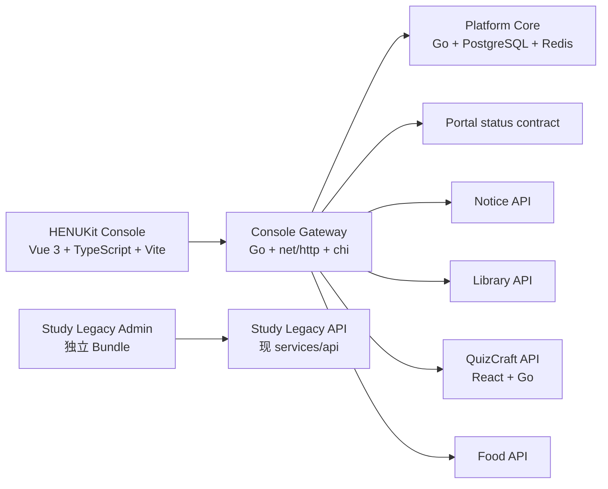

# HENUKit Console 与 QuizCraft 重构替代计划

> 状态：Accepted
> 日期：2026-07-19
> 替代：PR #21 `feat(admin): implement unified dashboard V1 workflows`

> 本计划描述 Planned 目标态，不代表对应应用或服务已经部署。当前实现状态与明确非目标见[执行规格的 Delivery Status](./henukit-console-executable-spec.md#delivery-status)；领域词汇以根目录 `CONTEXT.md` 为规范来源。

## 1. 目标

建立面向整个 HENU Kit 产品族的独立 HENUKit Console，并将原期末复习平台后台隔离为 Study Legacy Admin。Console 统一入口、身份、权限和观测，但不统一子产品数据库，也不继承旧学习平台的产品边界。

PR #21 不再以修补后合并为目标。它保持 Draft，待本计划对应的架构 PR 建立并回链后关闭；分支与提交历史保留，供后续选择性复用。

## 2. 已冻结的产品地图

Console Overview 固定展示六个平级模块：

1. Portal
2. Platform Operations
3. Notice
4. Library
5. QuizCraft
6. Food

Platform Operations 内部包含统一账户、权限与 Scope、Session、邮件基础设施、Operations Inbox、审计和平台运行状态。用户、邮件、反馈和系统状态不是四个独立产品域。

积分和会员是隐藏的 Candidate Capability，不进入 V1 导航、接口或数据看板。

## 3. 目标系统边界

### 3.1 前端部署单元

| 目录 | 职责 | 技术 | 禁止事项 |
|---|---|---|---|
| `apps/console` | HENUKit Console | Vue 3、TypeScript、Vite、shadcn-vue、Reka UI、Tailwind v4 | Element Plus、旧路由、旧 `isAdmin` |
| `apps/study-legacy-admin` | 旧学习平台存量后台 | 原 `apps/admin` 代码，保持行为不变 | 出现在 Console 导航或 Bundle |
| `apps/portal` | HENU Kit 公共主站 | 独立构建 | 通过 Console 编辑页面或触发部署 |
| `products/quizcraft/web-app` | QuizCraft 用户端与自有管理面 | React、TypeScript、Vite、pnpm | 在 Console 复制题库工坊 |

### 3.2 后端部署单元

| 服务 | 数据所有权 | 职责 |
|---|---|---|
| `services/console-gateway` | 无业务数据 | Console Session、权限校验、聚合、超时、受控转发和审计关联 |
| `services/platform-core` | 账户、权限、Scope、Session、Operations Inbox、邮件与平台审计 | 平台公共能力 |
| `services/notice` | 通知来源、版本、审核、受众和分发 | Notice Module API 与 Worker |
| `services/library` | 课程、资料、下载、投稿、审核和纠错 | 从 Study Legacy API 渐进提取 |
| `services/quizcraft` | 题库、题目版本、Practice Session、答题事实、收藏、排行和反馈 | 替换 FastAPI 后端 |
| `services/food` | 美食投稿、条目、校准轮次、票、异常与调档 | Food Module API |
| `services/api` | 旧学习平台存量数据 | Study Legacy API；冻结新增平台能力 |

每个服务使用独立数据库凭据。Console Gateway 不配置任何子产品数据库连接串。

## 4. Console 前端技术栈

- Vue 3 + TypeScript + Vite。
- shadcn-vue + Reka UI + Tailwind CSS v4。
- HENU Kit Design Tokens；不安装 Element Plus。
- TanStack Vue Query 管理服务端数据；Pinia 只保存 Console Session、权限上下文与少量 UI 状态。
- TanStack Table 按需用于复杂表格。
- ECharts 6 按需引入；每张图提供文字摘要或数据表。
- pnpm Workspace；包管理器迁移独立验证。
- Vitest + Vue Test Utils + Playwright。

## 5. 后端技术栈与契约

- Go + `net/http` + `chi`。
- PostgreSQL 使用 `pgx` + `sqlc` + 版本化 SQL Migration。
- 禁止 GORM、运行时 AutoMigrate 和用 SQLite 替代 PostgreSQL 集成测试。
- Redis 只用于限流、短期协调、Nonce、防重放、临时锁和可重建缓存。
- OpenAPI 3.1 API-first；每个数据 Owner 维护自己的契约。
- TypeScript 客户端和必要 Go 类型从契约生成。
- 服务间请求使用短期服务凭据、HMAC 或受控 mTLS；具体传输认证在安全 PR 冻结。

## 6. Console Session 与权限

1. 管理员在 Platform Core 账户中心登录。
2. Console Gateway 通过一次性授权码在服务端交换身份和 Console Access Context。
3. Gateway 建立独立 HttpOnly、Secure、SameSite Cookie Session。
4. 浏览器不保存长期 Token，不跨站共享 Cookie。
5. 模块可见性与操作由权限码 + Scope 决定，默认拒绝。
6. 冻结、角色撤销和 Session 撤销必须在目标时限内传播。

旧 `isAdmin`、单一 `users.role` 字符串和前端隐藏按钮均不能作为授权依据。

## 7. Gateway 聚合与降级规则

### 7.1 读取

- 六模块摘要并发请求。
- 单模块摘要默认超时 2 秒，整体 Overview 最迟 3 秒返回。
- 只对幂等 GET 做最多一次带抖动重试。
- 单模块失败不阻断其他模块，卡片显示 `unavailable`。
- 可显示最近一次成功摘要，但必须标为 `stale` 并携带 `as_of` 和 `last_success_at`。
- 缓存只用于摘要，默认最多 5 分钟；不能缓存敏感详情。

### 7.2 写入

- Gateway 不自动重试写请求。
- 所有有持久副作用的 POST/PATCH 必须携带 Idempotency-Key。
- Gateway 透传原始 request_id、Idempotency-Key 和操作者访问上下文。
- 数据 Owner 负责最终幂等、乐观版本、事务和审计。
- 超时返回未知结果时，前端必须查询操作状态，不能盲目再次提交。

## 8. Portal Module V1

Portal Module 只读展示：

- 当前部署版本、Commit SHA 和部署时间；
- readiness、关键页面探测和最近异常；
- 主站反馈摘要；
- 子产品入口健康状态。

导航、工具入口、展示文案和页面结构属于仓库 Portal Configuration，通过 Git、PR 与 CI/CD 变更。Console 不提供内容编辑、重新部署、回滚或版本切换。

## 9. QuizCraft 重构范围

### 9.1 保留

- 题库选择；
- 随机、难题和章节练习；
- 单选、多选、判断和填空；
- 答题结果与解析；
- 学习进度与错题；
- 题内纠错反馈；
- Bank Ranking、Overall Ranking、Weekly Ranking 和 Lifetime Ranking；
- Question Bank Workshop；
- 按题库收藏夹、Favorites Overview 和 Favorites Practice。

### 9.2 移除或暂缓

- 随机大转盘和 `food_wheel_items`：归 Food Module，不保留兼容入口。
- Electron 与 Android 外壳：V1 不迁移，先确保响应式 Web/PWA 可用。
- AI 生成解析：未决，不进入首批迁移 Gate。
- JSON 运行时兜底：改为显式导入工具，不作为生产读写源。
- 独立 `ADMIN_TOKEN`：由统一权限码与 Scope 替代。

### 9.3 收藏模型

- 登录用户按题库自动拥有一个 Per-Bank Favorites Folder。
- 收藏保存稳定题目引用，不复制题目正文。
- Favorites Overview 只展示各题库数量和入口。
- 每次 Favorites Practice 只使用一个题库的可用收藏。
- 题目下架后收藏关系保留为 Unavailable Favorite，但不展示正文、不进入练习。
- 游客可以刷题；收藏、错题和学习进度必须登录，不做本地收藏合并。

### 9.4 排行模型

- 主指标是服务端确认的 Correct Answer Count，重复练习答对继续累计。
- 每个 Practice Session、用户和题目最多产生一个 Scored Attempt；请求重放或并发重复提交不重复计分。
- 默认展示 Overall Weekly Ranking，同时提供 Overall Lifetime、Bank Weekly 和 Bank Lifetime。
- 只显示 Ranking Profile 的昵称和系统头像；用户可以退出公开排行。
- 不显示邮箱、学号、真实姓名和内部 user_id。
- 不发放明面奖励或暗积分，只产生 Ranking Settlement Event。

## 10. QuizCraft 数据迁移

### 10.1 题库与题目

- 先定义 `bank_id`、稳定 `question_id` 和 `question_version`。
- 从 PostgreSQL 生产表导出并校验；JSON 只作为显式补充输入。
- 对题库数、题目数、题型、答案、章节和内容 Hash 做双边对账。
- 新 Go API 先影子读取，不直接切生产写入。

### 10.2 排行与用户统计

- 旧生成 user_id 无法安全绑定统一账户，不自动猜测映射。
- 迁移前排行榜保留为只读 Legacy Ranking Snapshot。
- 新 Scored Attempt 从统一身份切流日开始计算 Weekly/Lifetime Ranking。
- 若未来提供旧身份认领，必须通过单独验证流程和 ADR。

### 10.3 反馈

- 迁移反馈 ID、题库/题目稳定引用、状态、备注和时间。
- 无法解析题目引用的记录进入迁移异常表，不静默丢弃。
- Operations Inbox 只保存反馈引用、负责人、SLA 和状态摘要；正文仍归 QuizCraft。

### 10.4 收藏

- 新功能从空集合开始，不从错题或浏览器状态推断收藏。

### 10.5 切流

1. OpenAPI 与数据库 Schema 冻结。
2. 全量迁移到临时新库并对账。
3. Go API 影子读并比较响应。
4. 旧后端继续唯一写入，增量迁移事件追平。
5. 小比例读流量切换。
6. 写流量在停写窗口或双写验证后切换。
7. 保留可回滚旧库快照与旧服务，只读观察至少一个发布周期。

## 11. PR #21 复用矩阵

### 可优先复用

- shadcn-vue 基础组件，但需移入新 `apps/console` 并去除旧依赖。
- TrendChart 的 ECharts 按需引入思路，补齐文字表格降级。
- MetricCard 的 `ok/partial/stale/unavailable` 状态测试思路。
- OpenAPI lint、正反例和生成一致性工作流结构。
- HMAC Nonce 重放测试、accepted 不等于 delivered、版本化 Migration 的测试场景。

### 只能参考、必须重写

- serviceauth middleware：重新核对 canonical string、权限上下文和 TTL 边界。
- Mail Worker：增加上下文超时、Provider 幂等或发送状态查询。
- Outbox：实现标准 Event Envelope、request_id、幂等消费和 DLQ。
- Object Storage signer：改用经过验证的 S3 SDK Presigner。

### 不复用

- AdminShellV2 的“旧版运营”导航。
- 已隔离到 `apps/study-legacy-admin` 的旧路由树和全局 Element Plus 入口。
- `UnifiedDomainView` 以六业务域替代产品模块的模型。
- 把新管理逻辑写入 `services/api` 的 Handler、Model 与 Migration。
- 单一 `users.role`、`isAdmin` 和统一 RequireAdmin Gate。
- PR #21 的 0002–0013 Migration 直接用于 Platform Core 或子产品新库。

## 12. PR 拆分顺序

1. **Docs only**：合入 Context、ADR、模块地图、数据 Owner、迁移矩阵和验收门槛。
2. **pnpm migration**：建立 Workspace，验证 Portal、Console、Study Legacy Admin 和 QuizCraft 前端构建。
3. **Admin physical split**：原 `apps/admin` 移为 `apps/study-legacy-admin`，行为不变；创建无旧依赖的最小 `apps/console` Bundle。
4. **Console foundation**：Vue、shadcn-vue、Tokens、路由、权限壳和六模块 Mock，不接真实数据。
5. **Platform Core foundation**：Go/chi/pgx/sqlc、Migration、账户授权码、权限与 Scope、Session。
6. **Console Gateway foundation**：独立部署、Console Session、权限校验、聚合 Envelope、超时与降级。
7. **Portal + Platform Operations**：先接只读 Portal 摘要和 Platform Operations。
8. **Notice contract and service**：独立数据 Owner、审核与分发契约。
9. **Library adapter**：先通过受控 Adapter 连接 Study Legacy API，再提取新 Library 服务。
10. **Food service and Console operations**：投稿、异常票和调档确认。
11. **QuizCraft contracts and Go shadow service**：稳定 ID、Practice、收藏、排行、反馈与题库工坊。
12. **QuizCraft migration and cutover**：对账、影子流量、灰度与回滚。
13. **Close PR #21**：替代 PR 已回链、关键基础 PR 通过后关闭，保留分支。

每个 PR 只能承担一个主要迁移风险，不把业务行为、数据库迁移和生产切流绑定在同一提交中。

## 13. 必须通过的 Gate

- `apps/console` Bundle 不包含 Element Plus、旧 Admin 路由或旧业务 API 类型。
- Console Gateway 无 GORM、无业务 Migration、无子产品数据库凭据。
- Platform Core 与各产品使用不同数据库账号；跨 Owner 直接查询测试必须失败。
- 权限测试覆盖无权限、越 Scope、冻结、撤销和伪造客户端 Role。
- PostgreSQL/Redis 集成测试使用真实临时依赖。
- Migration 通过空库、已有库、重复 Up、Down 和再次 Up。
- OpenAPI breaking-change 检查、生成一致性和实现一致性全部通过。
- 六模块 Overview 支持部分失败、过期数据、空数据和请求追踪。
- 所有写操作具备数据库最终幂等、乐观版本与审计。
- 桌面和 390px Playwright 关键流程通过。
- 生产切流前存在已验证的回滚点，不能以“Workflow 已启动”代替部署成功。

## 14. 当前未决事项

- QuizCraft AI 生成解析是否保留及其审核边界。
- 积分、会员及排行奖励是否进入未来版本。
- Portal 具体前端技术栈与首次实现计划。
- 各服务生产域名、基础设施编排与 Secret 管理的最终值。
